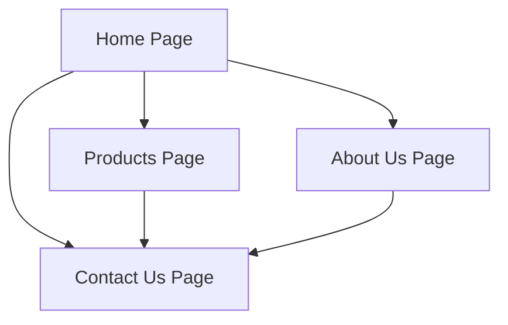

## 1. Product Overview
ChadGlobal Market is a general goods supply and trading company website that showcases products and enables customer contact without online payment functionality. The website serves as a digital catalog for individuals, retailers, and businesses to browse products and connect with the company for pricing and orders.

## 2. Core Features

### 2.1 User Roles
No user registration required - all visitors can browse products and contact the company as guest users.

### 2.2 Feature Module
The ChadGlobal Market website consists of the following main pages:
1. **Home page**: Company introduction, hero section, navigation to other pages
2. **About Us page**: Company mission, vision, and background information
3. **Products page**: Product categories and individual product listings
4. **Contact Us page**: Contact information and contact form

### 2.3 Page Details
| Page Name | Module Name | Feature description |
|-----------|-------------|---------------------|
| Home page | Hero section | Display company name, tagline, and call-to-action buttons for browsing products and contacting |
| Home page | Navigation | Header navigation menu linking to all main pages |
| Home page | Company introduction | Brief description of ChadGlobal Market services and value proposition |
| About Us page | Company overview | Detailed description of business operations and focus areas |
| About Us page | Mission statement | Display company mission to connect markets with quality goods |
| About Us page | Vision statement | Show company vision to become trusted global market partner |
| Products page | Category navigation | Organized product categories: Household Goods, Clothing & Accessories, Food & Beverage, Electronics & Accessories, Other General Goods |
| Products page | Product listings | Display products within each category with name, description, and contact button |
| Products page | Product details | Individual product cards with standardized description template |
| Contact Us page | Contact information | Display email, phone, WhatsApp, and business hours |
| Contact Us page | Contact form | Form for visitors to submit inquiries with name, email, message fields |
| Contact Us page | WhatsApp integration | Direct WhatsApp contact button with pre-filled message |

## 3. Core Process
Visitor Flow:
1. User lands on Home page and sees company introduction
2. User can navigate to Products page to browse categories
3. User clicks on product categories to view specific products
4. User contacts company via contact form or WhatsApp for pricing
5. User can also visit About Us page for company information

## 4. User Interface Design

### 4.1 Design Style
- **Primary Color**: Dark Blue (#1e40af) - Trust & professionalism
- **Secondary Color**: Green (#16a34a) - Growth & market
- **Background**: White (#ffffff) - Clean & modern
- **Button Style**: Rounded corners with hover effects
- **Typography**: 
  - Headings: Poppins font, bold weight
  - Body text: Open Sans/Arial, regular weight
- **Icon Style**: Simple line icons, consistent throughout

### 4.2 Page Design Overview
| Page Name | Module Name | UI Elements |
|-----------|-------------|-------------|
| Home page | Hero section | Full-width dark blue background, white text, two CTA buttons (Contact Us, Browse Products) |
| Home page | Navigation | Sticky header with company name left, menu items right, dark blue background |
| Products page | Category cards | Green header cards for each category, white background for product listings |
| Products page | Product cards | White cards with subtle shadow, product name, description, green contact button |
| Contact Us page | Contact info | Clean white cards with blue icons for each contact method |
| Contact Us page | Contact form | Simple form with rounded input fields, green submit button |

### 4.3 Responsiveness
Desktop-first design approach with mobile responsiveness. Layout adapts from multi-column desktop view to single-column mobile view. Touch-friendly buttons and navigation for mobile users.