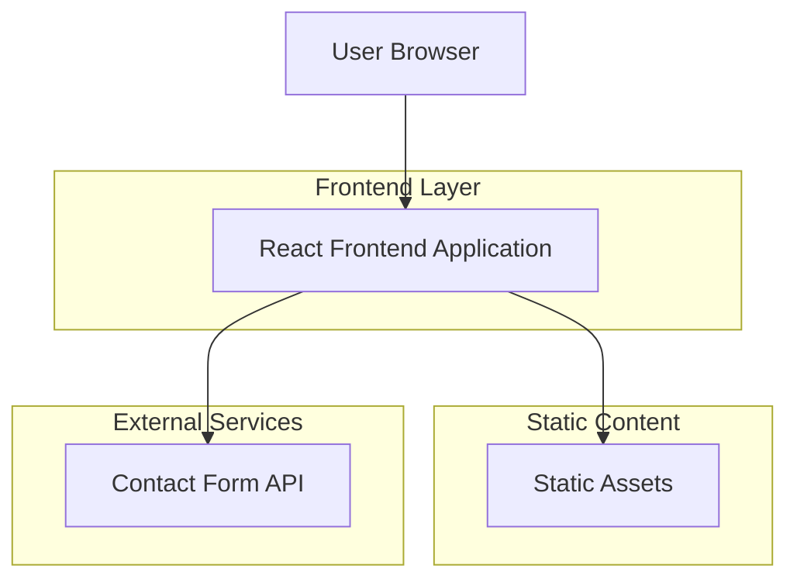

## 1. Architecture design



## 2. Technology Description
- Frontend: React@19 + tailwindcss@4 + vite
- Initialization Tool: vite-init
- Backend: None (static site with contact form integration)

## 3. Route definitions
| Route | Purpose |
|-------|---------|
| / | Home page, displays company introduction and navigation |
| /about | About Us page, company mission and vision |
| /products | Products page, product categories and listings |
| /contact | Contact Us page, contact information and form |

## 4. Component Structure
### 4.1 Core Components
- `Header`: Navigation component with responsive menu
- `Hero`: Landing section with company introduction
- `ProductCategory`: Category card component for product organization
- `ProductCard`: Individual product display component
- `ContactForm`: Contact form with validation
- `ContactInfo`: Contact details display component
- `Footer`: Site footer with quick links

### 4.2 Data Structure
```typescript
interface Product {
  id: string;
  name: string;
  category: string;
  description: string;
}

interface ContactForm {
  name: string;
  email: string;
  message: string;
}
```

## 5. Static Data Management
Product data will be stored as static JSON files and imported into components:
- `/src/data/products.json` - Product listings organized by category
- `/src/data/categories.json` - Product categories metadata
- Contact information stored as constants in configuration file

## 6. Styling Configuration
Tailwind CSS v4 configuration with custom color palette:
- Primary: Dark Blue (#1e40af)
- Secondary: Green (#16a34a)
- Neutral: White, Gray variants
- Typography: Poppins for headings, Open Sans for body text

## 7. Build and Deployment
- Development: Vite dev server with hot reload
- Production: Static build output suitable for any static hosting
- Deployment: Compatible with Netlify, Vercel, GitHub Pages, or traditional web hosting